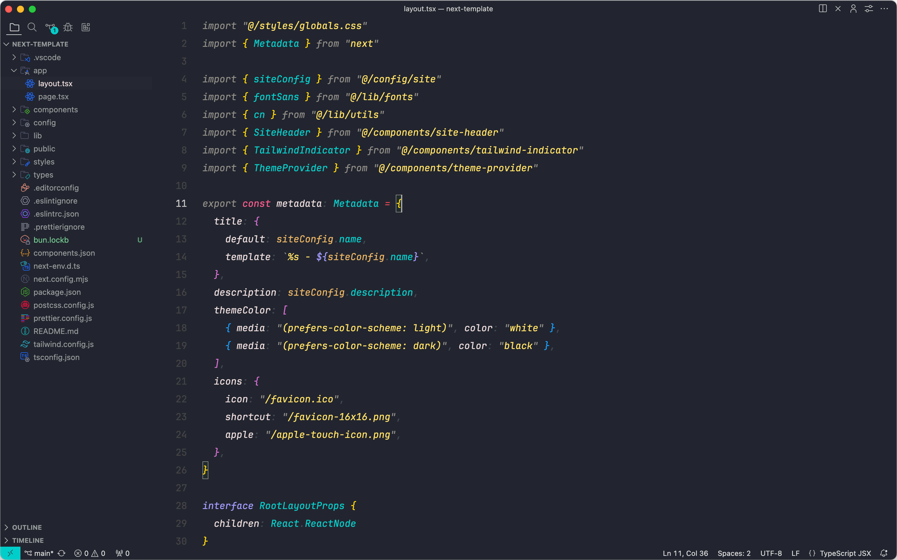

# VSCode Minimal Setup

- Theme | <a href="https://github.com/hiukky/flate">Flate</a>
- Font | <a href="https://www.jetbrains.com/lp/mono/">JetbrainsMono Nerd Font Mono</a>
- File Icons | <a href="https://marketplace.visualstudio.com/items?itemName=Catppuccin.catppuccin-vsc-icons">Catppuccin Icons for VSCode</a>
- Product Icons | <a href="https://github.com/antfu/vscode-icons-carbon">Carbon</a>

## License

Published under [Apache-2.0 License](./LICENCE).
